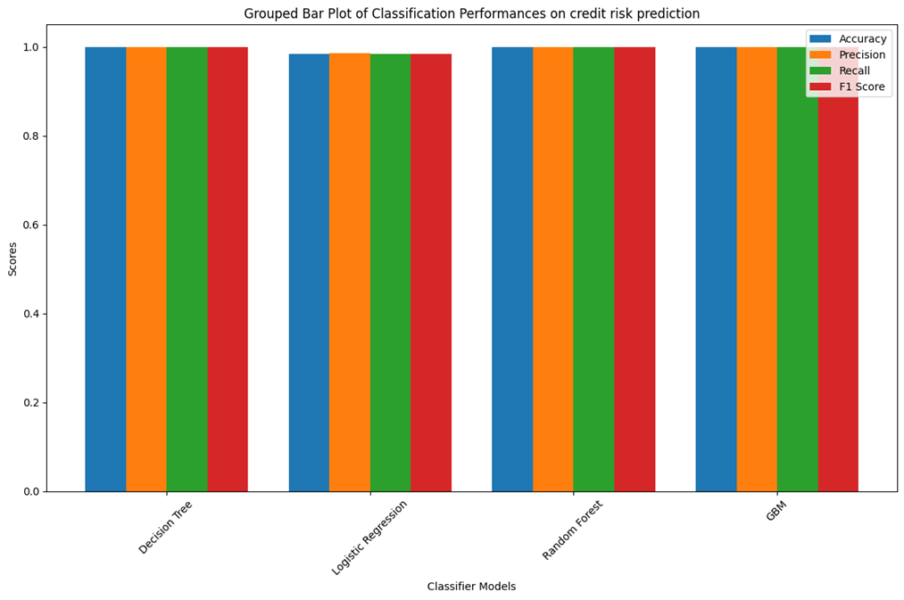

# Credit Scoring Model based on data provided by the eCommerce platform

General objective
    The overarching objective of this project is to develop a comprehensive Credit Scoring Model
    that accurately assesses the creditworthiness of potential borrowers for the Buy-Now-Pay-Later
    (BNPL) service offered by Bati Bank. This model will facilitate informed lending decisions by
    categorizing users into risk categories, predicting loan performance, and optimizing loan
    parameters.
Specific objectives
    1. Defines a proxy variable that can be used to categorize users as high risk (bad) or low
    risk (good)
    2. Select observable features that are good predictors (have high correlation) of the default
    variable defined in 1)
    3. Develop a model that assigns risk probability for a new customer
    4. Develop a model that assigns credit score from risk probability estimates
    5. Develop a model that predicts the optimal amount and duration of the loan

Figure: Comparison of different classifier models for Prediction of credit score